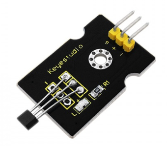
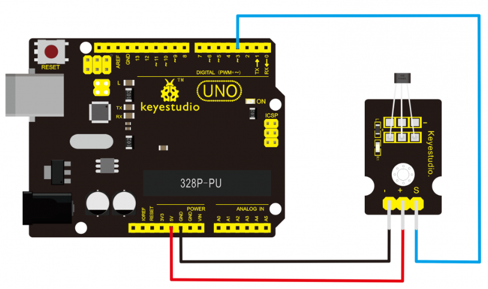
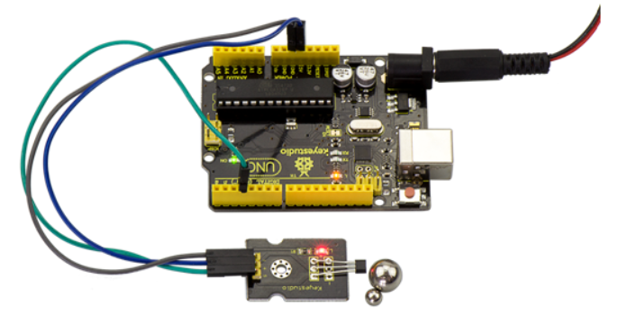

# KS0020 keyestudio Hall Magnetic Sensor

## 1. Introduction

This is a Magnetic Induction Sensor. It senses the magnetic materials within a detection range up to 3cm. The detection range and the strength of the magnetic field are proportional.The output is digital on/off. This sensor uses the SFE Reed Switch - Magnetic Field Sensor.



## 2. Specification

- Sensing magnetic materials
- Detection range: up to 3cm
- Output: digital on/off
- Detection range and magnetic field strength are proportional

## 3. Connection Diagram



## 4. Sample Code

Download code:  [Code](./Code.7z)

```
int ledPin = 13;                // choose the pin for the LED
int inputPin = 3;               // Connect sensor to input pin 3 
int val = 0;                    // variable for reading the pin status
 
void setup() 
{
  pinMode(ledPin, OUTPUT);      // declare LED as output
  pinMode(inputPin, INPUT);     // declare push button as input
}
 
void loop()
{
  val = digitalRead(inputPin);  // read input value
  if (val == HIGH) 
  {            // check if the input is HIGH
    digitalWrite(ledPin, LOW);  // turn LED OFF
  } 
  else 
  {
    digitalWrite(ledPin, HIGH); // turn LED ON
  }
}
```

## 5. Result

Wire it up and upload well the code to board, you will see that D13 indicator on UNO board is off, and led on the module is also off. But if put a magnetic ball close to the hall module, you will see the D13 indicator on UNO board is turned on, and led on the module is also turned on.

